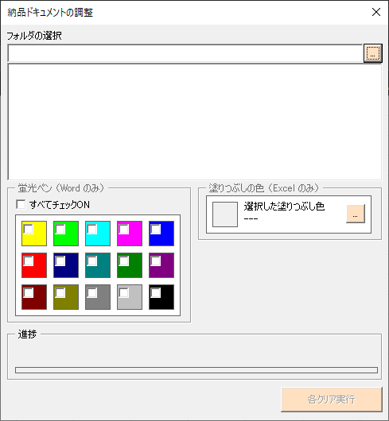

# DeliveryDocumentsCleaner
 
納品用のドキュメントを調整するツールです。

## デモ

## 機能
指定されたフォルダ内に格納された Office ドキュメントすべてに対してハイライトと個人情報をクリアして上書き保存します。

### Word
Word 文書より以下をクリアします。
* 個人情報
* 蛍光ペン

### Excel
Excel ブックより以下をクリアします。
* 個人情報
* 塗りつぶし色

## 使用方法

1. `DeliveryDocumentsCleaner.xlam` をダウンロードし任意の場所に保存
2. ダウンロードしたファイルのプロパティを変更

    

    ファイルのプロパティで赤枠の内容が表示される場合は「許可する」をチェックし「適用」をクリックしてください。

3. `DeliveryDocumentsCleaner.xlam` を開く
   
    
    
    この画面が表示されたら「マクロを有効にする」をクリックしてください。

4. Excel のリボンで「アドイン」→「納品ドキュメントの調整」をクリック

    

    この画面が表示されたら新規ブックを作成してください。

5. 対象ドキュメントが格納されたフォルダを選択

    

    * 右上の「...」でフォルダを選択

6. 対象ドキュメントの一覧より1件以上選択

    選択方法は Windows と同じ操作で Shift キーおよび Ctrl キーを使用します。

7. 「蛍光ペン（Word のみ）」よりクリアする蛍光ペンをチェック
    * クリアしない場合は、すべてチェックOFFしてください
8. 「塗りつぶし色（Excel のみ）」よりクリアする塗りつぶし色を選択
    * 選択した色を解除する場合は「色の設定」で「キャンセル」してください
9. 「各クリア実行」をクリック
    * ⚠️ 対象ドキュメントは事前にすべて閉じてください
    * ⚠️ 対象ドキュメントは上書き保存します

## その他
* [VBAメモ](doc/VBA_memo.md)